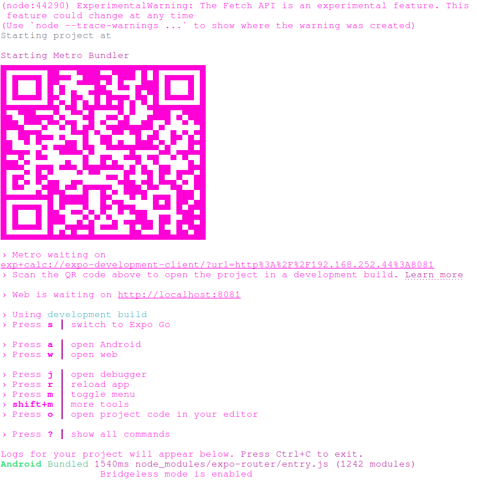
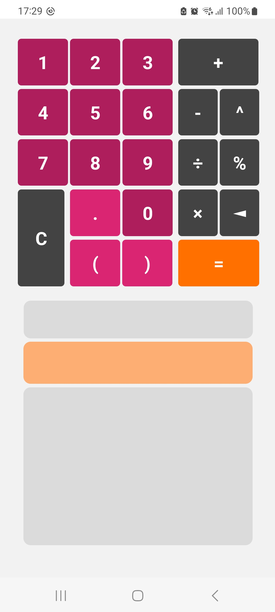
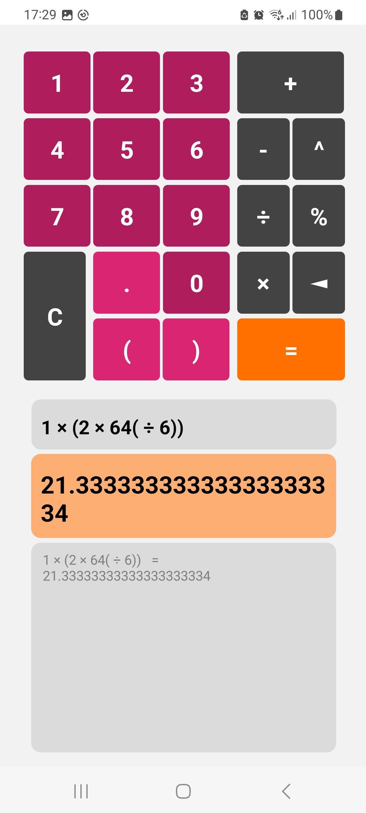

# React-Native Calculator App

Basic calculator application built using React Native with a-calc (https://www.npmjs.com/package/a-calc) & tested on Android (Samsung Galaxy S20+ (specifically)). Current sum, answer & a history of equations is logged and shown to the user with the input of irregalur equations being prevented (eg 8.8.8+3*-21+).

## Setup

Clone the repo:

      git clone https://github.com/AliCW/react-native-calculator/tree/main

Install dependencies:

      npm install

Start the application:

      npx expo start

Their are numerous approaches to bundling the code, follow the instructions in the terminal to start the application (example below), the easiest way (in my opinion) is using the QR code printed in terminal.

# Screenshots below

